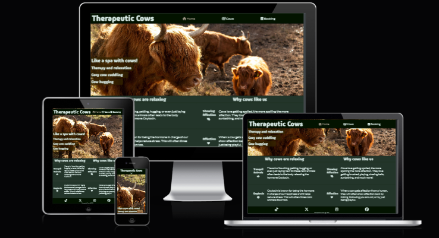
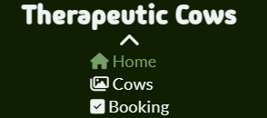
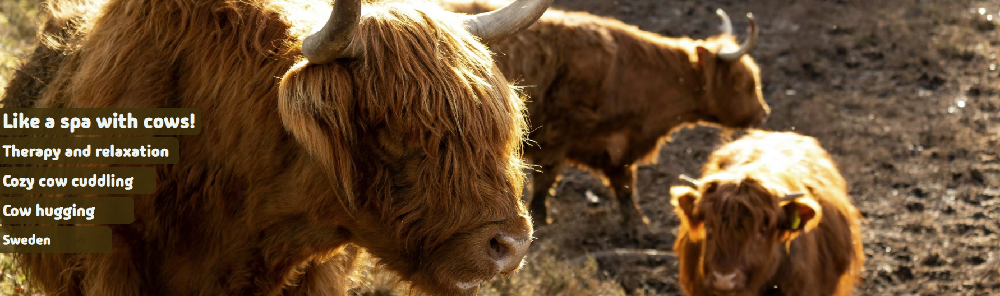
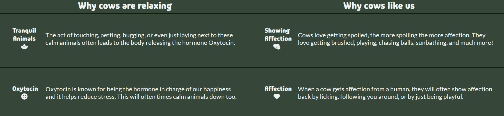
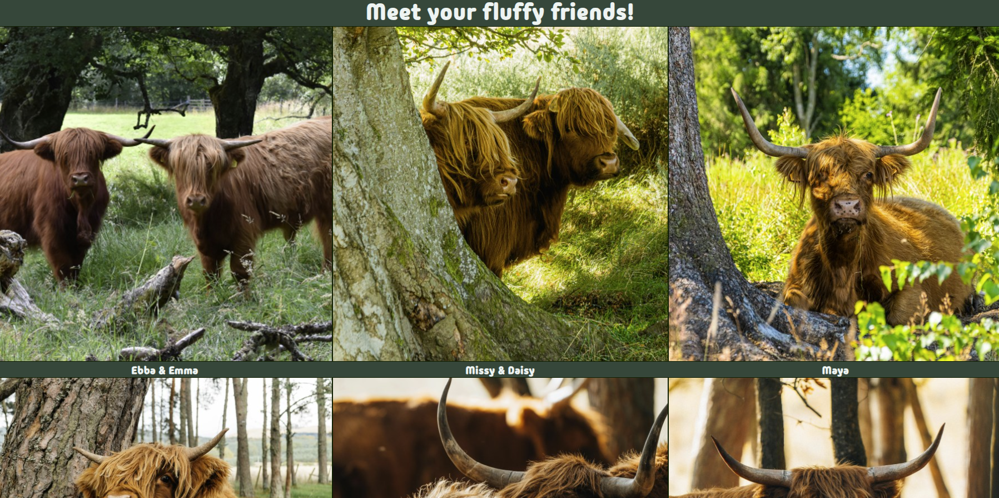
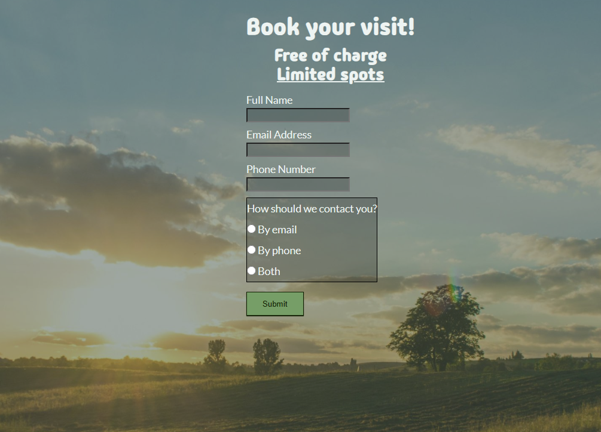
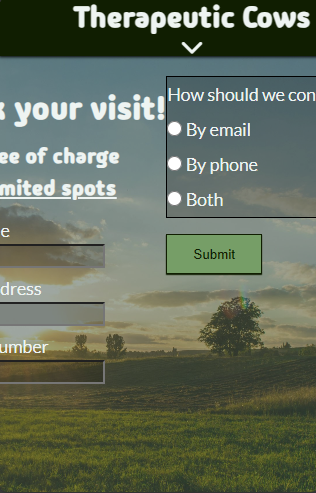

# Thereapeutic Cows
The Theraputic Cows website is place for anyone who might be looking for a natural substitute to therpay, be it coping of grief, stress release, or to simply experience some serenity. It's also for anyone who takes a liking to being around cows. We want more connection to nature!

The user will be presented with information as to why the activity could be of consideration and what benefits it may present. It should also give a brief overview as to what one could expect from it.

## Features
- **Color and contrast**
    - The site uses a contrast of a very light grey and a soothing green color to give a feeling of mindfullness and serenity while making the content very visible to the reader.

- **Navigation and header**
    - Conventionally featured at the top of the page with the name of the site and will *stay* at the top if the user scrolls downwards.
    - Navigation to all 3 pages can be found at the navigation bar, clearly indicated with highlight while hovering on computer devices, and with different icons.
    
    - For *smaller* width devices it features a toggleable navigation bar to free up space.
    

- **Landing page hero image**
    - The landing section features a warm photograph with a slightly see through text-overlay that briefly tells the user what to expect and the relevant location.
    - The user should feel encouraged to scroll down and find out more.
    

- **The activity essence section**
    - This section aims to tell the user the benefits and the hows of cow therapy and why it may be a good idea to give it a try.
    

- **Footer**
    - The footer features our 4 social media links which open in a new tab when clicked to avoid creating a nuisance.
    - It's a valuable aspect to encourage visitors to stay connected without specifically visiting our web page.
    

- **The Gallery**
    - The gallery will display images of all our *fluffy staff* to give an idea as to what to expect.
    - It provides value and should further encourage the user to explore what cow therapy has to offer them.
    

- **The Booking Page**
    - This page is here to allow the user to sign themselves up for the upcoming cow cuddling and therapy sessions. 
    - The sign up will ask the user to supply their full name, email address, and phone number. It will also ask the user their preferred way of getting contacted.
     

- **Features to implement in the future**
    - Automatic confirmation message for sign ups.
    - Lay groundwork for implementation of a payment system in case it'd be necessary to change that model. 

## Testing
- I have validated the website works on various browsers, such as Chrome, Edge, Firefox, and Safari.
- I have tested the project's responsiveness and fucntions across all standard screen sizes and breakpoints using Chromes devtools.
- Additionally I have tested the website on a different computer than this one, 2 different mobile devices, and on 1 tablet device.
- I have confirmed and adjusted text sizes and positioning based on size breakpoints to assure that the text remains readable and easy to understand.
-I have made sure that the form requires a proper email format, input for the full name and phone number, and that an option for preferred contact method is selcted before submission.

## Bugs

### Current bugs
- None known

### Solved bugs
- I noticed that on very low-height displays the Booking form would displace itself and sit up to the right of the form, off the screen.
    - I troubleshot using devtools and discovered that it was the "height: 100vh" on the form element making it unable to handle overflow.
    
    - Nesting the form inside a div for the background image and changing the height property to "min-height: 100vh" fixed the bug.

## Credits
https://pexels.com | Stjin Dijkstra, Vlad Bagacian\
https://unsplash.com | Charlie Firth, Eilis Garvey, Coralie Meurice, Brian Taylor