# Thereapeutic Cows
The Theraputic Cows website is place for anyone who might be looking for a natural substitute to therpay, be it coping of grief, stress release, or to simply experience some serenity. It's also for anyone who takes a liking to being around cows. We want more connection to nature!

The user will be presented with information as to why the activity could be of consideration and what benefits it may present. It should also give a brief overview as to what one could expect from it. 

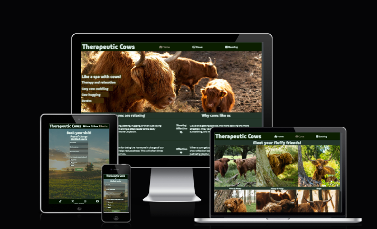

## Features
- **Color and contrast**
    - The site uses a contrast of a very light grey and a soothing green color to give a feeling of mindfullness and serenity while making the content very visible to the reader.

- **Navigation and header**
    - Conventionally featured at the top of the page with the name of the site and will *stay* at the top if the user scrolls downwards.
    - Navigation to all 3 pages can be found at the navigation bar, clearly indicated with highlight while hovering on computer devices, and with different icons. \
    
    - For *smaller* width devices it features a toggleable navigation bar to free up space. \
    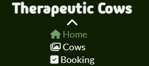

- **Landing page hero image**
    - The landing section features a warm photograph with a slightly see through text-overlay that briefly tells the user what to expect and the relevant location.
    - The user should feel encouraged to scroll down and find out more. \
    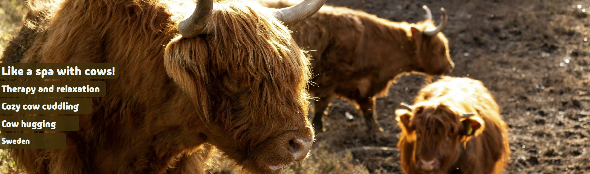

- **The activity essence section**
    - This section aims to tell the user the benefits and the hows of cow therapy and why it may be a good idea to give it a try. \
    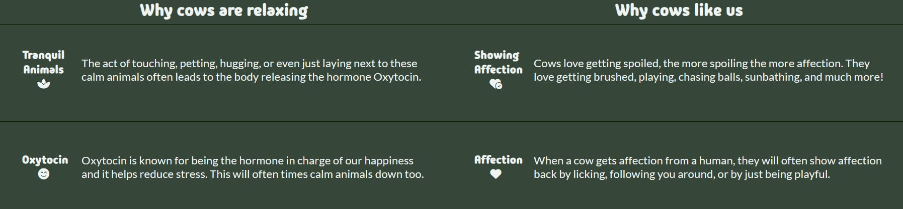

- **Footer**
    - The footer features our 4 social media links which open in a new tab when clicked to avoid creating a nuisance.
    - It's a valuable aspect to encourage visitors to stay connected without specifically visiting our web page. \
    

- **The Gallery**
    - The gallery will display images of all our *fluffy staff* to give an idea as to what to expect.
    - It provides value and should further encourage the user to explore what cow therapy has to offer them. \
    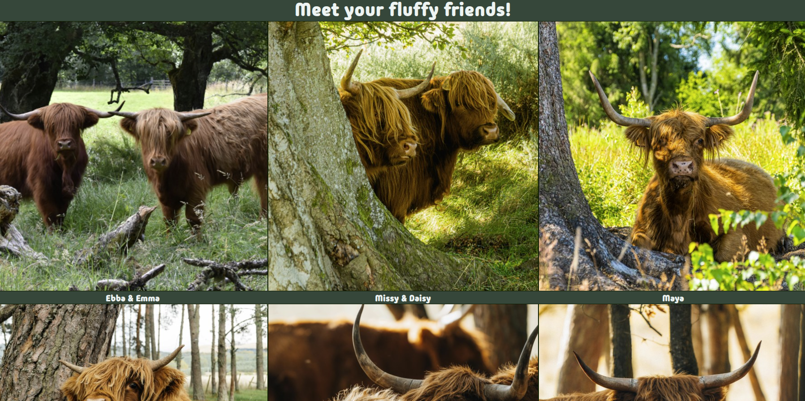

- **The Booking Page**
    - This page is here to allow the user to sign themselves up for the upcoming cow cuddling and therapy sessions. 
    - The sign up will ask the user to supply their full name, email address, and phone number. It will also ask the user their preferred way of getting contacted. \
    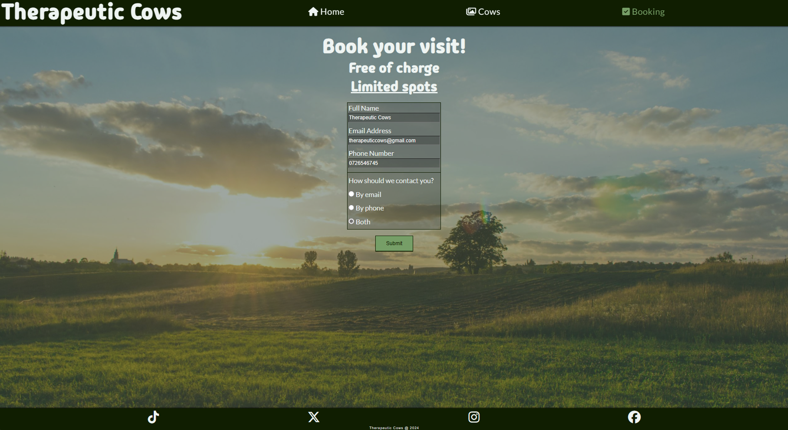

- **The Confirmation Page**
    - The confirmation is for the user to get notified that they filled out the form correctly and that they should be hearing back from us shortly.
    - It should provide the user with a sense of success and thrill to be hearing more. \
    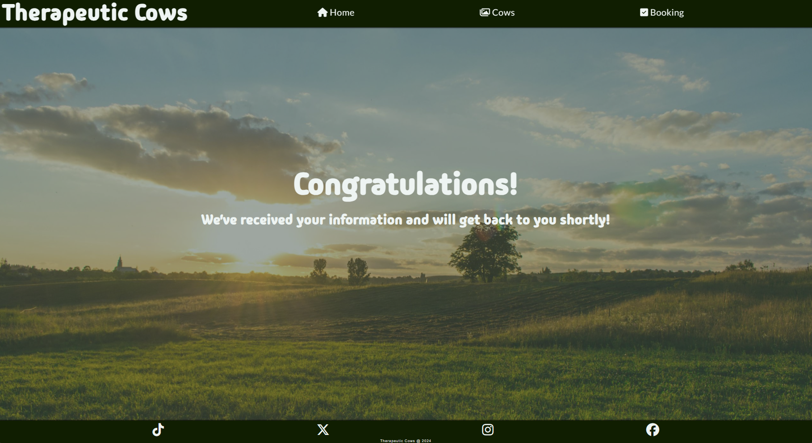

- **Features to implement in the future**
    - Automatic confirmation message for sign ups.
    - Lay groundwork for implementation of a payment system in case it'd be necessary to change that model. 

## Technologies
- HTML
    - Used to create and structure the content of the website.

- CSS
    - Used for styling and layout adjustment of the content.

- Font Awesome
    - Used to import icons wherever needed.

- Google Fonts
    - Used to import the Lato and Madimi One fonts for the website.

- Favicon.io
    - Used for page favicon.

## Testing
- I have validated the website works on various browsers, such as Chrome, Edge, Firefox, and Safari.

- I have tested the project's responsiveness and fucntions across all standard screen sizes and breakpoints using Chromes devtools. Which includes:
    - All page navigation buttons taking the user to the intended page.
        - Navigation bar toggling works as intended for mobile devices.
    
    - The form requiring input in every field and prompting the user with a successful form submission.
        - During this I discovered the input type for the full name field was bad.

    - I discovered the booking form being unable to handle overflow on very low-height displays.
        - It now handles overflow and works as intended.

- Additionally I have tested the website on a different computer than this one, 2 different mobile devices, and on 1 tablet device.

- I have confirmed and adjusted text sizes and positioning based on size breakpoints to assure that the text remains readable and easy to understand.

### Test Cases

- Index
    - Open the index homepage
        - Expected output: Be shown page header with "Home" highlighted in green, hero image, and text content.
        - Actual output: Page header with "Home" highlighted in green, hero image, and text content displayed when opened.
    
    - Click main heading on page header
        - Expected output: Have index page refreshed as it opens again.
        - Actual output: Index page was refreshed.

    - Click the highlighted "Home" button on nav-bar.
        - Expected output: Have index page refreshed as it opens again.
        - Actual output: Index page was refreshed.

    - Click the "Cows" button on nav-bar.
        - Expected output: Get directed to the cow-gallery page.
        - Actual output: Directed to the cow-gallery page.
    
    - Click the "Booking" button on nav-bar.
        - Expected output: Get directed to the booking page.
        - Actual output: Directed to the booking page.

    - Scroll down the page.
        - Expected output: Find the page footer with social media links under the main page content.
        - Actual output: Footer found at the bottom of the page with our 4 social media links.

    - Click each social media icon at the page footer.
        - Expected output: Each icon should open a new page leading the user to each corresponding social media platform.
        - Actual result: Each icon opened a new tab when clicked and led to the platform associated with the icon. \
        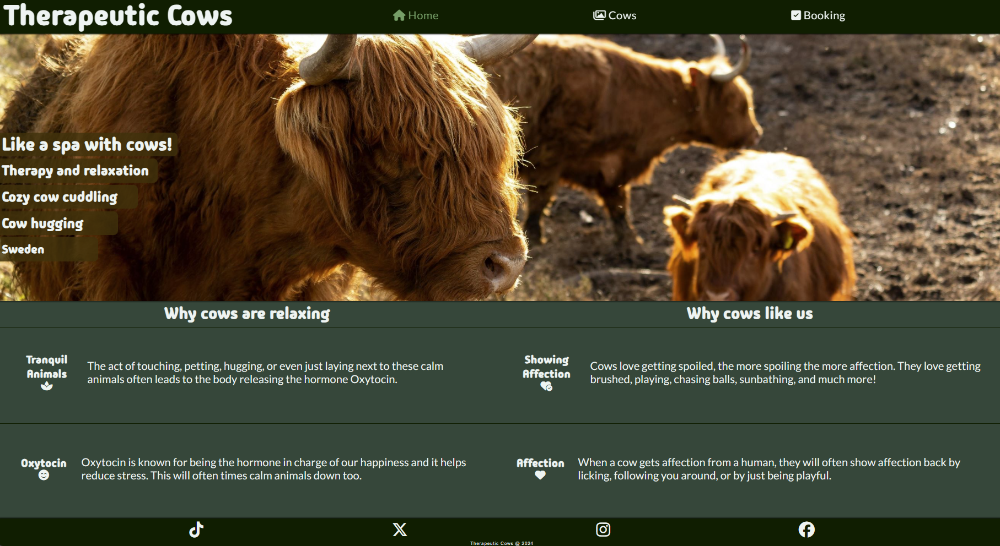
- Gallery
    - Open the gallery page.
        - Expected output: See the page header with "Cows" highlighted in green, along with headings, and images of the cows.
        - Actual result: Page header with "Cows" highlighted in green, headings, and pictures of the cows shown.

    - Click main heading on page header
        - Expected output: Get directed to the index page.
        - Actual output: Directed to the index page.

    - Click the "Home" button on nav-bar.
        - Expected output: Get directed to the index page.
        - Actual output: Directed to the index page.

    - Click the highlighted "Cows" button on nav-bar.
        - Expected output: Have the current page refreshed as it gets directed to again.
        - Actual output: Gallery page was refreshed.
    
    - Click the "Booking" button on nav-bar.
        - Expected output: Get directed to the booking page.
        - Actual output: Directed to the booking page.

    - Scroll down the page.
        - Expected output: Find the page footer with social media links under the main page content.
        - Actual output: Footer found at the bottom of the page with our 4 social media links.

    - Click each social media icon at the page footer.
        - Expected output: Each icon should open a new page leading the user to each corresponding social media platform.
        - Actual result: Each icon opened a new tab when clicked and led to the platform associated with the icon. \
        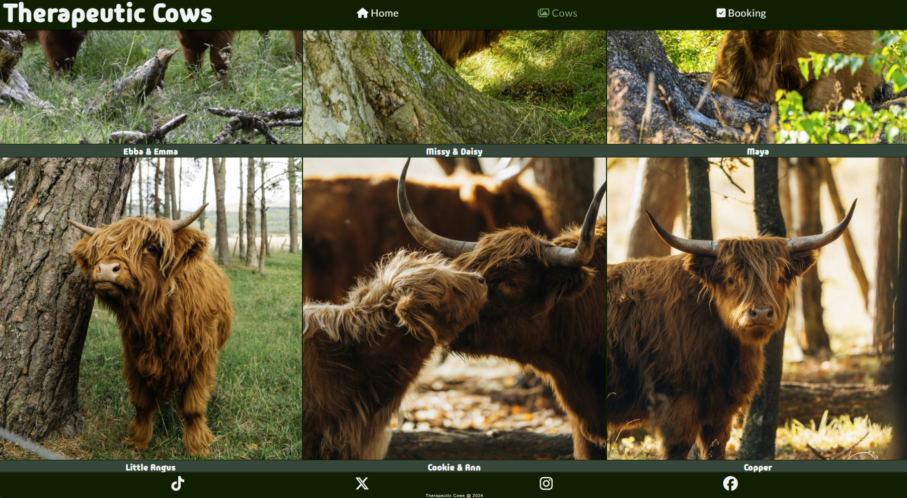

- Booking
    - Open the booking page.
        - Expected output: See the page header with "Booking" highlighted in green, page footer, a background image of a field, and the booking form with headings above.
        - Acutal output: Page header with "Booking" highlighted in green, page footer, background image of a field, and booking form with headings above displayed.
    
    - Click main heading on page header
        - Expected output: Get directed to the index page.
        - Actual output: Directed to the index page.

    - Click the "Home" button on nav-bar.
        - Expected output: Get directed to the index page.
        - Actual output: Directed to the index page.

    - Click the "Cows" button on nav-bar.
        - Expected output: Get directed to the cow-gallery page.
        - Actual output: Directed to the cow-gallery page.
    
    - Click the highlighted "Booking" button on nav-bar.
        - Expected output: Have the current page refreshed as it gets directed to again.
        - Actual output: Booking page was refreshed.

    - Click each social media icon at the page footer.
        - Expected output: Each icon should open a new page leading the user to each corresponding social media platform.
        - Actual result: Each icon opened a new tab when clicked and led to the platform associated with the icon.

    - Move over and click the green "Submit" button under the form.
        - Expected output: When hovered with the pointer button turns to a different shade of green. When clicked user will be asked to fill out their full name.
        - Acutal output: Submit button changed color shade when hovered and user was propmted to fill out their full name.
    
    - Enter full name and click "Submit" again.
        - Expected result: User prompted to fill out their email address in the email field.
        - Actual result: User propmted to fill out the email field.

    - Enter an incomplete email and click "Submit" again.
        - Expected result: User will be prompted to enter a valid email address containing an "@".
        - Actual result: User propmted to enter a valid email address including an "@".

    - Enter a valid email addres and click "Submit" again.
        - Expected result: User will be prompted to please fill out the phone number field.
        - Actual result: User prompted to enter their phone number in the phone number field.

    - Enter phone number and click "Sumbit" again.
        - Expected result: User will be prompted to please select one of the three options for how to get contacted.
        - Actual result: User prompted to select one of the three options.

    - Select an option and click "Submit" again. 
        - Expected result: User will be directed to a confirmation page stating they will get contacted soon.
        - Actual result: User was directed to confirmation page saying they should be contacted soon. \
        

- Confirmation
    - Get directed to the confirmation page by filling out the form and sumbitting.
        - Expected result: User will see page header with nothing highlighted on nav-bar, page footer, the same background from the booking page, and a congratulations message.
        - Actual result: User shown the page header with no highlight, page footer, the same background from the booking page, and a big congratulations message.

    Click main heading on page header
        - Expected output: Get directed to the index page.
        - Actual output: Directed to the index page.

    - Click the "Home" button on nav-bar.
        - Expected output: Get directed to the index page.
        - Actual output: Directed to the index page.

    - Click the "Cows" button on nav-bar.
        - Expected output: Get directed to the cow-gallery page.
        - Actual output: Directed to the cow-gallery page.
    
    - Click the "Booking" button on nav-bar.
        - Expected output: Get directed to the booking page.
        - Actual output: Directed to the booking page.

    - Click each social media icon at the page footer.
        - Expected output: Each icon should open a new page leading the user to each corresponding social media platform.
        - Actual result: Each icon opened a new tab when clicked and led to the platform associated with the icon. \
        

### Bugs

#### Current and unfixed bugs
- None known

#### Solved bugs
- I noticed that on very low-height displays the Booking form would displace itself and sit up to the right of the form, off the screen.
    - I troubleshot using devtools and discovered that it was the "height: 100vh" on the form element making it unable to handle overflow.\
    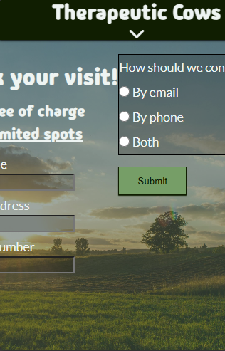
    - Nesting the form inside a div for the background color and adding a flex grow property to the section fixed the bug.

- Closing tags were found outside of their parent in navbar. \
`<li><a href="index.html"><i class="fa-solid fa-house"></i> Home</li></a>`
    - Fixed by nesting the closing tags inside the list.

### Validation
- HTML
    - No errors returned on any of the pages through the official W3C validator.
- CSS
    - No errors found after CSS was ran through the official W3C jigsaw validator.
- Accessibility
    - By running the page through lighthouse using devtools I confirmed that the colors and visuals are readable and accessible to the user.\
    Lighthouse desktop \
    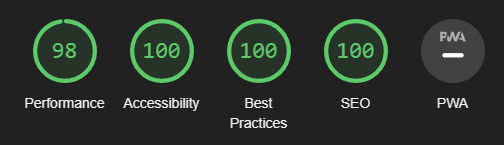 \
    Lighthouse mobile \
    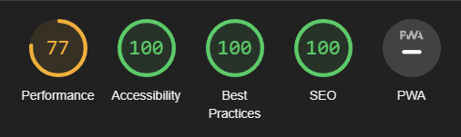
        
## Deployment

### Web
- The site was deployed using GitHub pages. Steps taken to deploy:
    - From the GitHub repository, go to Settings.
    - Under Code and automation, click pages.
    - Set soruce to deploy from branch and use the *main* branch as well as the *root* folder.
    - Once done the link to the website could be above build and deployment.
Website live link: [Therapeutic Cows](https://felteng.github.io/therapeutic-cows/)

### Local
- For coding purposes the site was also deployed locally:
    - In your IDE, open a terminal.
    - In the terminal enter: "python3 -m http.server" and hit enter.
    - Click Open Browser on the pop up window that appears on your screen.
        - Optionally click Open Preview to open a preview in your IDE.

## Credits

### Content
- Asterisk CSS selector to override default browser styling from [CI's](https://codeinstitute.net) loverunning walkthrough project.

- Social media links HTML code structure taken from [CI's](https://codeinstitute.net) loverunning walkthrough project.

- Fonts from [Google fonts](https://fonts.google.com/).

### Media
- Favicon from [Favicon.io](https://favicon.io/)

- All images taken from: 
    - [Pexels](https://pexels.com) | Stjin Dijkstra, Vlad Bagacian
    - [Unsplash](https://unsplash.com) | Charlie Firth, Eilis Garvey, Coralie Meurice, Brian Taylor, Hannah Hirleman

